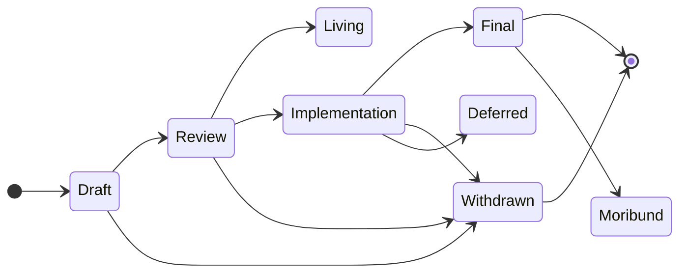

# Draft Specifications for EIP and ERC's

## Writing Style

> [!Note]
> see <https://www.rfc-editor.org/rfc/rfc2119.txt>

      The key words "MUST", "MUST NOT", "REQUIRED", "SHALL", "SHALL
      NOT", "SHOULD", "SHOULD NOT", "RECOMMENDED",  "MAY", and
      "OPTIONAL" in this document are to be interpreted as described in
      RFC 2119.

   Note that the force of these words is modified by the requirement
   level of the document in which they are used.

1. MUST   This word, or the terms "REQUIRED" or "SHALL", mean that the
   definition is an absolute requirement of the specification.

2. MUST NOT   This phrase, or the phrase "SHALL NOT", mean that the
   definition is an absolute prohibition of the specification.

3. SHOULD   This word, or the adjective "RECOMMENDED", mean that there
   may exist valid reasons in particular circumstances to ignore a
   particular item, but the full implications must be understood and
   carefully weighed before choosing a different course.

4. SHOULD NOT   This phrase, or the phrase "NOT RECOMMENDED" mean that
   there may exist valid reasons in particular circumstances when the
   particular behavior is acceptable or even useful, but the full
   implications should be understood and the case carefully weighed
   before implementing any behavior described with this label.

## EIP Proposal for new Transaction Type and corresponding RPC

## Draft EIPS

### eth_getTransactionConfirmations

The purpose of this method is to return the number of transactions an account has broadcasted or sent.

## Well Defined EIPs

Below EIPs are considered a **requeriment** for us:

-   [EIP-2718 | Transaction Envelopes](https://eips.ethereum.org/EIPS/eip-2718)

    **Abstract**: `TransactionType || TransactionPayload` is a valid transaction and `TransactionType || ReceiptPayload` is a valid transaction receipt where `TransactionType` identifies the format of the transaction and `*Payload` is the transaction/receipt contents, which are defined in future EIPs.

-   [EIP-2930 | Optional access lists](https://eips.ethereum.org/EIPS/eip-2930)

    **Abstract**: We introduce a new [EIP-2718](./reference/EIPS/eip-2718.md) transaction type, with the format `0x01 || rlp([chainId, nonce, gasPrice, gasLimit, to, value, data, accessList, signatureYParity, signatureR, signatureS])`. The `accessList` specifies a list of addresses and storage keys; these addresses and storage keys are added into the `accessed_addresses` and `accessed_storage_keys` global sets (introduced in [EIP-2929](./reference/EIPS/eip-2929.md)). A gas cost is charged, though at a discount relative to the cost of accessing outside the list.

-   [EIP-3584 | Block Access Lists](https://eips.ethereum.org/EIPS/eip-3584)

    **Abstract**: A proposal to build a block's `access_list` and include its fingerprint `AccessListRoot` in the block header.

### Complementary EIPs

Below EIPs are considered **complimentary** we don't depend on but can serve us as inspiration:

-   [EIP 2976 | Typed Transactions over Gossip](https://eips.ethereum.org/EIPS/eip-2976)

    **Abstract**: [Typed Transactions](./reference/EIPS/eip-2976.md) can be sent over devp2p as `TransactionType || TransactionPayload`. The exact contents of the `TransactionPayload` are defined by the `TransactionType` in future EIPs, and clients may start supporting their gossip without incrementing the devp2p version. If a client receives a `TransactionType` that it doesn't recognize, it **SHOULD** disconnect from the peer who sent it. Clients **MUST NOT** send new transaction types before they believe the fork block is reached.

## EIP Political Process

