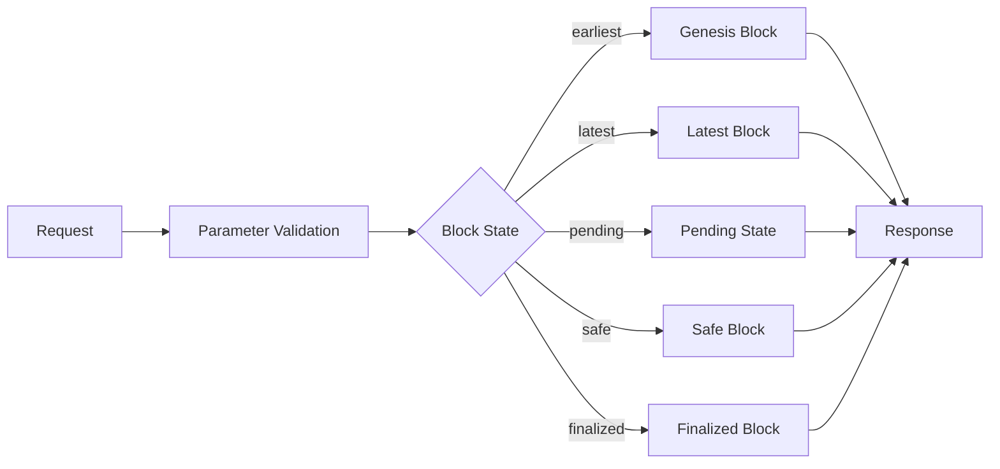

<!-- TOC --><a name="block-state-json-rpc-method-specification"></a>
# [`eth_getBlockState`](#) 

## JSON-RPC Method Specification

- [Block State JSON-RPC Method Specification](#block-state-json-rpc-method-specification)
   * [Method Name](#method-name)
   * [Description](#description)
   * [Parameters](#parameters)
   * [Returns](#returns)
   * [Example Request](#example-request)
   * [Example Response](#example-response)
   * [Error Codes](#error-codes)
   * [Specification Notes](#specification-notes)
   * [State Diagram](#state-diagram)
   * [Additional Examples](#additional-examples)
      + [Request with "earliest" block](#request-with-earliest-block)
      + [Response for "earliest" block](#response-for-earliest-block)
      + [Error Response Example](#error-response-example)

<!-- TOC --><a name="method-name"></a>
## Method Name
`eth_getBlockState`

<!-- TOC --><a name="description"></a>
## Description
Returns the chain ID, block number, and block state for the specified block parameter.

<!-- TOC --><a name="parameters"></a>
## Parameters
1. `blockParameter` - An object containing one of the following block state identifiers:

   - `{ "blockNumber": "earliest" }` - Earliest/genesis block
   - `{ "blockNumber": "latest" }` - Latest canonical block
   - `{ "blockNumber": "pending" }` - Pending state/transactions
   - `{ "blockNumber": "safe" }` - Most recent safe block
   - `{ "blockNumber": "finalized" }` - Most recent finalized block

<!-- TOC --><a name="returns"></a>
## Returns

Object - A block state object containing:
- `chainId`: STRING - The chain ID in hexadecimal format
- `blockNumber`: STRING - The block number in hexadecimal format
- `blockState`: STRING - One of: "earliest", "latest", "pending", "safe", "finalized"

<!-- TOC --><a name="example-request"></a>
## Example Request
```json
{
  "jsonrpc": "2.0",
  "method": "eth_getBlockState",
  "params": [
    {
      "blockNumber": "latest"
    }
  ],
  "id": 1
}
```

<!-- TOC --><a name="example-response"></a>
## Example Response
```json
{
  "jsonrpc": "2.0",
  "id": 1,
  "result": {
    "chainId": "0x1",
    "blockNumber": "0xf4240",
    "blockState": "latest"
  }
}
```

<!-- TOC --><a name="error-codes"></a>
## Error Codes
| Code | Message | Description |
|------|---------|-------------|
| -32700 | Parse error | Invalid JSON |
| -32600 | Invalid Request | JSON is not a valid request object |
| -32601 | Method not found | Method does not exist |
| -32602 | Invalid params | Invalid method parameters |
| -32603 | Internal error | Internal JSON-RPC error |

<!-- TOC --><a name="specification-notes"></a>
## Specification Notes

1. **EIP-1898 Compliance**
   - The block parameter MUST be specified as an object
   - The object MUST contain a `blockNumber` field
   - The value MUST be one of the specified string literals

2. **EIP-1474 Compliance**
   - Method name follows the `eth_` namespace convention
   - Adheres to standard JSON-RPC 2.0 format
   - All numeric values are hexadecimal encoded
   - Error codes follow standard ranges

3. **Additional Requirements**
   - The response MUST include all three fields: chainId, blockNumber, and blockState
   - Chain ID MUST be returned in hexadecimal format
   - Block number MUST be returned in hexadecimal format
   - Block state MUST be one of the five specified string literals

<!-- TOC --><a name="state-diagram"></a>
## State Diagram



<!-- TOC --><a name="additional-examples"></a>
## Additional Examples

<!-- TOC --><a name="request-with-earliest-block"></a>
### Request with "earliest" block
```json
{
  "jsonrpc": "2.0",
  "method": "eth_getBlockState",
  "params": [
    {
      "blockNumber": "earliest"
    }
  ],
  "id": 1
}
```

<!-- TOC --><a name="response-for-earliest-block"></a>
### Response for "earliest" block
```json
{
  "jsonrpc": "2.0",
  "id": 1,
  "result": {
    "chainId": "0x1",
    "blockNumber": "0x0",
    "blockState": "earliest"
  }
}
```

<!-- TOC --><a name="error-response-example"></a>
### Error Response Example
```json
{
  "jsonrpc": "2.0",
  "id": 1,
  "error": {
    "code": -32602,
    "message": "Invalid params",
    "data": "Invalid block parameter"
  }
}
```
