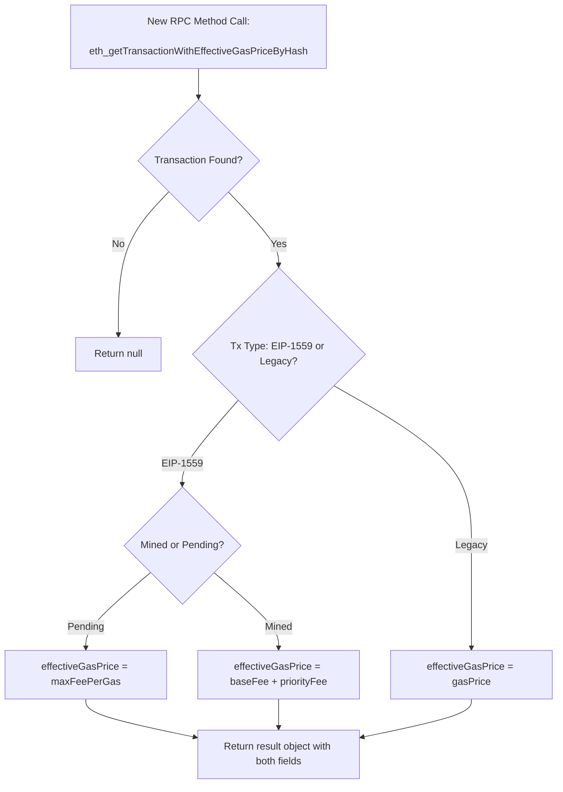

## Simple Summary

This EIP introduces a new JSON-RPC method, `eth_getTransactionWithEffectiveGasPriceByHash`, which returns both:

1. The original `gasPrice` field (maintaining legacy values).
2. A new, dedicated field `effectiveGasPrice` that reflects the actual cost for EIP-1559 transactions (and, by extension, legacy transactions, if needed).

In contrast to overloading the existing `gasPrice` field, this method cleanly separates the conceptual “raw transaction price” from the “final or effective cost,” ensuring clarity for both EIP-1559 and legacy transactions.

## Abstract

Under EIP-1559, a transaction’s actual gas price can differ from the raw `gasPrice` or `maxFeePerGas` values, due to the base fee + priority fee mechanism. Many tools still rely on reading `gasPrice` to estimate user costs or display information about transactions.

This proposal adds a **new RPC method**—`eth_getTransactionWithEffectiveGasPriceByHash`—to provide:

- `gasPrice` as originally specified (for legacy transactions) or potentially empty/0 for EIP-1559 transactions if the node chooses to store it that way.  
- `effectiveGasPrice` to show the real “paid” gas price (if mined) or an appropriate fallback (e.g., `maxFeePerGas`) if pending.

This avoids changing the behavior of existing RPC methods like `eth_getTransactionByHash` and thereby preserves backward compatibility.

## Motivation

1. **Clarity**  
   - By placing the “real” or “final” gas price into a distinct field (`effectiveGasPrice`), users can easily distinguish between what was *submitted* (legacy `gasPrice` or EIP-1559 `maxFeePerGas`) and what was *paid*.

2. **Backward Compatibility**  
   - Many dApps and scripts already consume `gasPrice` from existing methods. Altering that behavior can cause breakage or confusion. Instead, a new RPC method keeps existing methods intact.

3. **Tooling Adoption**  
   - Tools (block explorers, analytics platforms, wallets) that want clarity on EIP-1559 fees can adopt the new method and safely reference `effectiveGasPrice`.

4. **Future-Proof**  
   - With any upcoming Ethereum changes that further shift how gas is calculated, a dedicated “effective” fee field remains a flexible extension point.

## Specification

### 1. New JSON-RPC Method: `eth_getTransactionWithEffectiveGasPriceByHash`

**Method Name**: `eth_getTransactionWithEffectiveGasPriceByHash`

**Description**:  
Returns information about a transaction by its hash, including both the original `gasPrice` (if available) and a new `effectiveGasPrice` field.

**Parameters**:

1. `transactionHash` (`DATA`, 32 bytes) – The hash of a transaction.

**Returns**: A `TransactionWithEffectiveGasPrice` object, or `null` if no transaction is found.

```solidity
interface TransactionWithEffectiveGasPrice {
  hash: string;
  nonce: string;
  blockHash: string | null;
  blockNumber: string | null;
  transactionIndex: string | null;
  from: string;
  to: string | null;
  value: string;
  gas: string;
  gasPrice: string | null;         // The original gas price for a legacy tx, or possibly 0/null for EIP-1559
  maxFeePerGas: string | null;     // EIP-1559 field
  maxPriorityFeePerGas: string | null;
  type: string | null;
  input: string;
  effectiveGasPrice: string;       // The newly introduced field
}
```


### Field Definitions

#### gasPrice
- Type: string or null
- Behavior: For legacy transactions, this is the original gasPrice specified by the sender. For EIP-1559 transactions, some implementations set this to 0x0 or leave it null.

#### effectiveGasPrice
- Type: string
- Behavior:
  - If the transaction is mined and EIP-1559, effectiveGasPrice = baseFeePerGas + (actual) priorityFeePerGas
  - If the transaction is pending and EIP-1559, effectiveGasPrice = maxFeePerGas
  - If the transaction is legacy, effectiveGasPrice = gasPrice3. Transaction State Logic


### Pending

EIP-1559:
gasPrice = (could be 0x0 or absent if the node stores only EIP-1559 fields)
effectiveGasPrice = maxFeePerGas
Legacy:
gasPrice = the original gas price
effectiveGasPrice = gasPrice
Mined

### EIP-1559:
gasPrice = (could be 0x0 or null if the node stores only EIP-1559 fields)
effectiveGasPrice = baseFeePerGas + priorityFeePerGas (from the block and transaction data)

### Legacy:
gasPrice = the original gas price
effectiveGasPrice = gasPrice

### Data Model
Below is a sample JSON Schema describing the new RPC method’s return object:

```jsonc
{
  "TransactionWithEffectiveGasPrice": {
    "type": "object",
    "properties": {
      "hash": {
        "type": "string",
        "description": "Hash of the transaction."
      },
      "nonce": {
        "type": "string",
        "description": "Transaction nonce."
      },
      "blockHash": {
        "type": ["string", "null"],
        "description": "Block hash, or null if pending."
      },
      "blockNumber": {
        "type": ["string", "null"],
        "description": "Block number, or null if pending."
      },
      "transactionIndex": {
        "type": ["string", "null"],
        "description": "Position of this transaction in the block, or null if pending."
      },
      "from": {
        "type": "string",
        "description": "Sender address."
      },
      "to": {
        "type": ["string", "null"],
        "description": "Recipient address, or null for contract creation."
      },
      "value": {
        "type": "string",
        "description": "Value transferred in wei."
      },
      "gas": {
        "type": "string",
        "description": "Gas provided by the sender."
      },
      "gasPrice": {
        "type": ["string", "null"],
        "description": "Original gas price (legacy) or null/0 for EIP-1559."
      },
      "maxFeePerGas": {
        "type": ["string", "null"]
      },
      "maxPriorityFeePerGas": {
        "type": ["string", "null"]
      },
      "type": {
        "type": ["string", "null"]
      },
      "input": {
        "type": "string"
      },
      "effectiveGasPrice": {
        "type": "string",
        "description": "The final or estimated gas price for this transaction."
      }
    }
  }
}
```

1. EIP-1559 Pending Transaction

```jsonc
// Request
{
  "jsonrpc": "2.0",
  "method": "eth_getTransactionWithEffectiveGasPriceByHash",
  "params": [
    "0x1234abcd5678ef..."
  ],
  "id": 1
}
```

```jsonc
// Response
{
  "jsonrpc": "2.0",
  "id": 1,
  "result": {
    "hash": "0x1234abcd5678ef...",
    "nonce": "0x1",
    "blockHash": null,
    "blockNumber": null,
    "transactionIndex": null,
    "from": "0xSenderAddress",
    "to": "0xReceiverAddress",
    "value": "0x0",
    "gas": "0x5208",
    "gasPrice": null,                 // Possibly null for EIP-1559
    "maxFeePerGas": "0x59682f00",
    "maxPriorityFeePerGas": "0x3b9aca00",
    "type": "0x2",
    "input": "0x",
    "effectiveGasPrice": "0x59682f00" // fallback to maxFeePerGas for pending
  }
}
```
2. EIP-1559 Mined Transaction


```jsonc
// Request
{
  "jsonrpc": "2.0",
  "method": "eth_getTransactionWithEffectiveGasPriceByHash",
  "params": [
    "0x4567efgh1234ab..."
  ],
  "id": 1
}
```
```jsonc
// Response
{
  "jsonrpc": "2.0",
  "id": 1,
  "result": {
    "hash": "0x4567efgh1234ab...",
    "nonce": "0x1",
    "blockHash": "0xBlockHashValue",
    "blockNumber": "0xA",
    "transactionIndex": "0x1",
    "from": "0xSenderAddress",
    "to": "0xReceiverAddress",
    "value": "0x0",
    "gas": "0x5208",
    "gasPrice": null,                   // Possibly null for EIP-1559
    "maxFeePerGas": "0x59682f00",
    "maxPriorityFeePerGas": "0x3b9aca00",
    "type": "0x2",
    "input": "0x",
    "effectiveGasPrice": "0x3b9aca02"   // baseFeePerGas + priorityFeePerGas
  }
}
```

3. Legacy Transaction (Pending or Mined)

```jsonc
// Request
{
  "jsonrpc": "2.0",
  "method": "eth_getTransactionWithEffectiveGasPriceByHash",
  "params": [
    "0x9abc0ff98765321..."
  ],
  "id": 1
}
```
// Response

```jsonc
{
  "jsonrpc": "2.0",
  "id": 1,
  "result": {
    "hash": "0x9abc0ff98765321...",
    "nonce": "0x5",
    "blockHash": "0xBlockHashValueOrNull",
    "blockNumber": "0xF" /* or null if pending */,
    "transactionIndex": "0x1" /* or null if pending */,
    "from": "0xSenderAddress",
    "to": "0xReceiverAddress",
    "value": "0x0",
    "gas": "0x5208",
    "gasPrice": "0x3b9aca00",           // Original legacy gas price
    "maxFeePerGas": null,
    "maxPriorityFeePerGas": null,
    "type": "0x0",                      // or "0x0" for legacy
    "input": "0x",
    "effectiveGasPrice": "0x3b9aca00"   // Matches gasPrice for legacy
  }
}
```


Mermaid Diagram
A simple flow that highlights how the new RPC populates effectiveGasPrice while preserving gasPrice:



## Rationale

- No Breaking Changes: Existing methods (e.g., eth_getTransactionByHash) remain unmodified. Old tooling that expects the current behavior sees no impact.

- Explicit Clarity: By naming the new method to highlight “effectiveGasPrice,” developers and users clearly know where to look for final cost data.

- Simplicity for EIP-1559: Tools reading effectiveGasPrice do not need to compute or guess the final cost from maxFeePerGas, maxPriorityFeePerGas, or the block’s base fee.

## Backwards Compatibility
All legacy JSON-RPC methods remain the same.
No effect on existing clients beyond adding support for an optional new method.
If a client does not implement this EIP, it simply returns an “unknown method” error when called.
Use Cases
Block Explorers
Explorers can call this new method to neatly retrieve both the original gas price and the actual cost for all transactions.
Wallets
A wallet can display two separate lines of information: “You entered X as your gas price/max fee” vs. “The final cost was Y.”
Analytics
Fee tracking or DEX aggregator scripts no longer have to compute effective gas price from multiple fields. The node provides it in one request.
Test Cases
EIP-1559 Transaction Not Mined
gasPrice = null or 0x0
effectiveGasPrice = maxFeePerGas
EIP-1559 Transaction Mined
gasPrice = null or 0x0
effectiveGasPrice = baseFeePerGas + actual priority fee
Legacy Transaction
gasPrice retains the original value
effectiveGasPrice = same as gasPrice
Security Considerations
No changes to transaction validation or block structure.
Minimal risk that a client might misreport the effective gas price if incorrectly implementing the logic (i.e., not summing baseFeePerGas + actual priorityFeePerGas). Rigorous tests and client cross-checking are recommended.

### Reference Implementation (Pseudocode)


```python
def eth_getTransactionWithEffectiveGasPriceByHash(tx_hash):
    tx = fetch_tx_from_db(tx_hash)
    if not tx:
        return None

    # Build the result object
    result = {
        "hash": tx.hash,
        "nonce": hex(tx.nonce),
        "blockHash": tx.blockHash if tx.blockHash else None,
        "blockNumber": hex(tx.blockNumber) if tx.blockNumber else None,
        "transactionIndex": hex(tx.index) if tx.index is not None else None,
        "from": tx.fromAddr,
        "to": tx.toAddr,
        "value": hex(tx.value),
        "gas": hex(tx.gas),
        "input": tx.inputData,
        "gasPrice": None,  # default
        "maxFeePerGas": tx.maxFeePerGas,
        "maxPriorityFeePerGas": tx.maxPriorityFeePerGas,
        "type": tx.txType,
        "effectiveGasPrice": None
    }

    if tx.isEIP1559():
        # EIP-1559
        if tx.storedGasPrice is not None:
            # Some clients store a "dummy" gasPrice
            result["gasPrice"] = hex(tx.storedGasPrice)
        
        if not tx.isMined():
            # Pending
            result["effectiveGasPrice"] = hex(tx.maxFeePerGas)
        else:
            # Mined -> actual cost
            block = fetch_block(tx.blockHash)
            base_fee = block.baseFeePerGas
            # priorityFee can be read from receipts, or internally tracked
            priority_fee = tx.actualPriorityFeePaid
            result["effectiveGasPrice"] = hex(base_fee + priority_fee)
    else:
        # Legacy
        result["gasPrice"] = hex(tx.gasPrice)
        result["effectiveGasPrice"] = hex(tx.gasPrice)

    return result

```

## Conclusion
This EIP introduces a new RPC method that neatly exposes the original gasPrice (where available) and a new effectiveGasPrice field. It thereby resolves confusion around EIP-1559 transactions without modifying existing methods. By distinguishing “raw transaction price” from “final or actual price,” developers can cleanly adopt EIP-1559 while preserving backward compatibility for legacy tooling.
